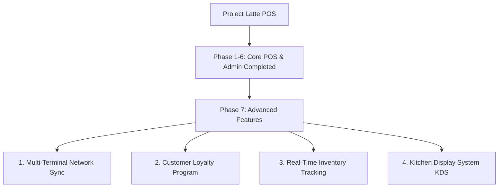

# PROJECT LATTE: POS SYSTEM BLUEPRINT
**Comprehensive Development Plan, Functional Requirements & Implementation Roadmap**

---

## 1. Project Vision & Architecture
**Project Latte** is a premium, native Windows desktop Point of Sale (POS) application engineered specifically for high-speed café operations. Designed with a bespoke, curated aesthetic (**Cremes & Mochas**), the system prioritizes offline-first reliability, instantaneous local database queries, rigorous administrative security, and automated Philippine Bureau of Internal Revenue (BIR) tax compliance.

---

## 2. Technical Stack
*   **Core Framework**: Flutter for Windows Desktop (Native C++ compilation).
*   **State Management**: Provider ecosystem (`ChangeNotifier` + `MultiProvider`) for reactive, decoupled UI updates.
*   **Database Engine**: SQLite via `sqflite_common_ffi` (Local-first, zero internet dependency, instantaneous query indexing).
*   **Design System**: Custom Latte Theme System (`#F3EFE9` Crema background, `#7A6657` Espresso primary, `#3C2A21` Dark Roast text, `#C84B31` Terracotta accent).
*   **Hardware Integration**: ESC/POS Protocol via USB buffer (`USB001`) and direct PDF generation (`printing` + `pdf` packages).

---

## 3. Core Features Implemented (Phases 1 to 6)

### Phase 1: Core POS Engine & State Management
*   **Centralized `OrderProvider`**: Manages active cart items, quantity increments, modifiers, and subtotal calculations.
*   **Tax Engine (`TaxService`)**: Implements strict Philippine tax formulas for 12% VAT inclusion/exclusion and 20% Senior Citizen / PWD discounts.

### Phase 2: Cashier UI & Menu Grid
*   **3-Column Desktop Ergonomics**: Left Category Navigation Rail (`c1` to `c6`), Middle Dynamic Product Grid (48 official menu items), Right Active Order Summary.
*   **Menu Hierarchy**: Parent-child modifier flow allowing quick selection of sizes (Small/Medium for Hot, Medium/Large for Iced) and attached add-ons (syrups, sauces, shots).

### Phase 3: Payment Gateway & Compliance
*   **Split-Screen Payment Modal**: Dedicated tabs for Cash and e-Wallet transactions.
*   **Cash Calculator**: Instant big-number change calculation to eliminate cashier mental math errors.
*   **e-Wallet Integration**: Interactive on-screen touch numpad with quick prefix buttons (`GCash-`, `Maya-`, `QR-`) for rapid reference number logging.
*   **BIR Tax Exemption Dialog (`SCPwdDialog`)**: Mandatory ID verification and automated VAT deduction + 20% discount calculation for Senior Citizens and PWDs.

### Phase 4: Transaction Auditing & Security
*   **Transaction History (`HistoryScreen`)**: Searchable, filterable audit log of all daily transactions.
*   **Secure Voiding**: PIN-protected authorization (`_voidOrder`) required to cancel completed transactions, instantly updating SQLite transaction flags.

### Phase 5: Hardware & Thermal Receipt Integration
*   **Thermal Receipt Preview (`ReceiptPreviewModal`)**: Fixed-height, scroll-isolated 80mm thermal paper preview matching physical ESC/POS hardware outputs.
*   **Dual-Action Printer Dock**: Supports simulated USB buffer printing (`USB001`) and direct standalone PDF generation/saving via native Windows dialogs.

### Phase 6: Admin Management Console
*   **Secure Access**: Protected by 4-digit Admin PIN authorization (`1234`) from the cashier dashboard.
*   **Sales Analytics & Reconciliation**:
    *   **Financial Overview**: Real-time KPI cards for Gross Revenue, Net Revenue (Gross - VAT - Discounts), VAT collected, SC/PWD discounts applied, Transaction Counts, and Average Order Value.
    *   **Tender Reconciliation**: Visual breakdown of Cash Drawer (Physical Cash), E-Wallet (GCash/Maya transfers), and Credit/Debit Card terminal totals for shift-end audits.
    *   **Sales by Menu Category**: SQL `JOIN`-powered breakdown of quantity sold and gross revenue per category (e.g., Hot Coffee, Frappes), backed by automated background SQLite table seeding and dynamic ID-to-name mapping.
    *   **Animated Revenue Charts**: Custom, animated hourly sales bar chart tracking peak business hours with interactive tooltips.
    *   **Top Products Ranking**: Aggregated ranking table for the top 10 best-selling items by volume and revenue.
    *   **Responsive Layout**: Bulletproof desktop scaling utilizing `Expanded` and `TextOverflow.ellipsis` to eliminate `RenderFlex` overflow exceptions on narrow window widths.
*   **Export & Accounting Reports**:
    *   **Interactive Filter Bar**: Enterprise multi-criteria filtering by custom Date Range, Payment Method (`All`, `Cash`, `E-Wallet`, `Card`), and Transaction Status (`All`, `Completed`, `Voided`).
    *   **Daily Sales Report (PDF)**: Multi-page formal accounting report embedding financial summaries, tender reconciliation, and category sales tables.
    *   **Filtered Accounting (CSV)**: Master transaction spreadsheet dynamically injecting shop credentials (`Store Name`, `Address`, `TIN`) and applied filter metadata for QuickBooks / Excel import.
    *   **Filtered Inventory (CSV)**: Granular itemized line-item spreadsheet tracking every individual cup, size, and add-on sold for precise inventory depletion audits.
*   **System Settings Panel**: Live configuration of shop credentials, tax/discount rates, and hardware peripheral settings, dynamically injected into all generated reports.

---

## 4. Features To Be Implemented (Phase 7 & Post-MVP)

### 1. Multi-Terminal Network Syncing (Local Socket Sync)
*   **Objective**: Enable multiple cashier terminals to synchronize transaction data with a centralized master terminal over a local Area Network (LAN) without requiring an active internet connection.
*   **Implementation**: Use WebSockets or local TCP sockets to broadcast transaction events and merge SQLite journals.

### 2. Customer Loyalty Program
*   **Objective**: Build customer retention through an automated points accumulation and redemption system.
*   **Implementation**: 
    *   Add a `Customer` table in SQLite tracking phone numbers, names, and earned points.
    *   Integrate a "Link Customer" button in the checkout flow to award 1 point per 100 PHP spent.
    *   Allow points redemption as direct cash discounts during payment.

### 3. Real-Time Inventory Tracking & COGS
*   **Objective**: Link sales deductions directly to raw ingredient stock levels (e.g., coffee beans, milk, cups, syrups) to prevent stockouts and track Cost of Goods Sold (COGS).
*   **Implementation**:
    *   Create an `Inventory` and `Recipe` schema mapping menu items to ingredient deductions (e.g., 1 Latte = 18g Espresso + 200ml Milk + 1 Cup).
    *   Implement low-stock threshold alerts on the Cashier and Admin dashboards.

### 4. Kitchen Display System (KDS) Integration
*   **Objective**: Replace physical paper tickets in the barista preparation area with a touch-interactive digital display queue.
*   **Implementation**: Build a dedicated `BaristaScreen` that listens to incoming pending orders from the `OrderProvider`, allowing baristas to tap orders to mark them as "Preparing" or "Completed".
